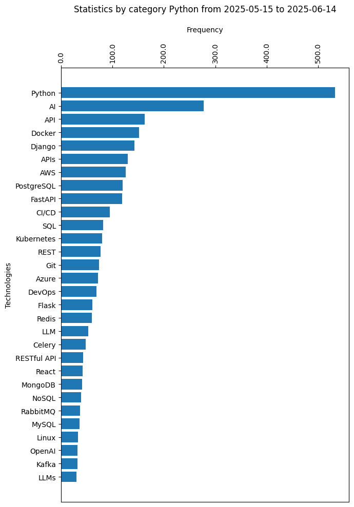

# TechTrendStat

**Technology Trends Statistician** is your go-to tool for real-time insights into the ever-changing technology landscape, combining web scraping and data analysis to track and analyze the latest trends in development job descriptions.

## Features

- [Scraping jobs from Djinni](techtrendscrape/spiders/djinni.py) by several specialization categories (e.g. Python, Java, DevOps, etc.).
- Ability to work with local and cloud MongoDB, as well as with regular CSV files.
- Using [`Pydantic` models](database/models.py) instead of standard items for better data validation.
- [Database collections](database/collections.py) to simplify connection to MongoDB.
- [Two pipelines](techtrendscrape/pipelines.py) (Mongo and CSV).
- [Data Wrangling](techtrendanalysis/wrangler.py). Clean up text and extract technology statistics.

## Linux Installation

> **NOTE:** Python version >3.9 is required.

Clone the repository:

```bash
git clone --recurse-submodules https://github.com/AndriyKy/tech-trend-stat.git
cd tech-trend-stat
```

Install [`uv`](https://docs.astral.sh/uv/) manager and set the `PYTHONPATH` environment variable:

```bash
# Install uv with our official standalone installer.
curl -LsSf https://astral.sh/uv/install.sh | sh
export UV_ENV_FILE=.env
export PYTHONPATH="$(pwd):$(pwd)/techtrendanalysis:$(pwd)/techtrendanalysis"
```

Create a copy of the file [`.env.copy`](.env.copy) and set the required variables:

```bash
cp .env.sample .env
```

## Getting Started

If you decide to work with MongoDB, here is a [tutorial](https://sparkbyexamples.com/mongodb/run-mongodb-in-docker-container/) on how to install it locally in a Docker container. Here is also the [instruction](https://www.mongodb.com/docs/atlas/create-connect-deployments/) on how to create a cluster on the cloud.

Once the database has been successfully installed, you just need to run the following command to scrape the vacancies using the `scrapy` spider along with the Mongo pipeline:

```bash
uv run scrapy crawl djinni -a categories="Python"
```

To scrape the vacancies into a CSV file, comment out all the `MONGODB_*` environment variables and run the command above.

You can substitute "Python" for any other category, or a stack of categories separated by a " | ". See available specializations (categories) on the [Djinni](https://djinni.co/jobs) website.

To extract statistics from job descriptions, run the [`wrangler`](techtrendanalysis/wrangler.py) file, passing the desired category name:

```bash
uv run spacy download en_core_web_md
uv run python3.13 -m techtrendanalysis.wrangler
```

## Data Analysis

To see the visualization of the extracted statistics, please, head over to the [`analysis`](techtrendanalysis/analysis.ipynb) file and follow the instructions given there.

Here is an example of a visualized result


